<p align="center">
  
</p>

<p align="center">
  
</p>

---

## 🧠 Profil

```diff
+ Développeur Fullstack Web & Mobile
+ Passionné par les architectures modernes, l’IA et l’automatisation
+ Approche orientée performance, UX et scalabilité
````

📍 **Antananarivo, Madagascar**

---

## 🧊 Stack technique

### 💻 Langages

<p>
  
</p>

### 🌐 Frontend

<p>
  
</p>

### 📱 Mobile

<p>
  
</p>

### ⚙️ Backend

<p>
  
</p>

### 🗄️ Bases de données

<p>
  
</p>

---
<center>

</center>

---

## 🎓 Workflow – Études & Formations

```mermaid
flowchart LR
    BAC[Baccalauréat Scientifique] --> LIC[Licence Informatique & Télécom]
    LIC --> MASTER[Master I Génie Logiciel & IA] 
    MASTER --> HACK[Hackathons & Compétitions]
    HACK --> MASTERII[Master II Génie Logiciel & IA]
    MASTERII --> AUTO[Auto-formation continue]
```



---

## 🏆 Achievements & Hackathons

🥇 **ZahaGeek 2024**
🥇 **WeeklyDev ISPM 2023**
🥉 **BattleDev 2024**
❤️ **WebCup 2024**
❤️ **RedShalk 2024**

---

## 📊 GitHub Analytics

<p align="center">
  
</p>

<p align="center">
  
</p>

<p align="center">
  
</p>

---

## 🧠 Langages dominants

<p align="center">
  
</p>

---

## 🎯 Centres d’intérêt

♟️ Échecs · 🎸 Guitare · 🎨 Dessin

---

<p align="center">
  
</p>

